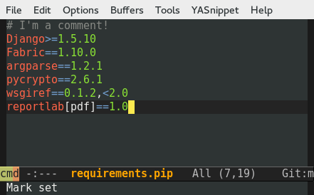

# pip-requirements.el

This is a major mode for editing pip requirements files, with the following features:

* Syntax highlighting
* Togglable comments
* Auto completion of package names from PyPI

## Changelog

### 0.4

Auto-completion of package names! See screenshot above. Requires
auto-complete, and your Emacs must be compiled with libxml support.

Added support for toggling comments with `M-;`.

### 0.3

Improved syntax highlighting in different version strings. Improved
detection of pip requirements files (it's now anything that matches
`*.pip` or `requirements*.txt`).

### 0.2

First public release, just syntax highlighting.

## Credits

This package is very much inspired by
https://github.com/wuub/requirementstxt for Sublime.
