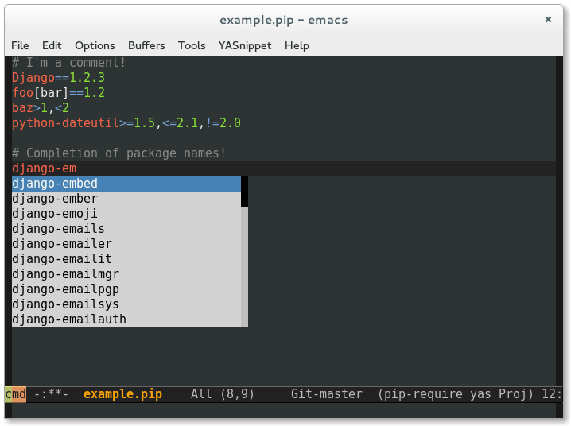

# pip-requirements.el

[](http://melpa.org/#/pip-requirements)
[](http://stable.melpa.org/#/pip-requirements)

This is a major mode for editing pip requirements files, with the following features:

* Syntax highlighting
* Togglable comments
* Auto completion of package names from PyPI



## Auto Completion

This major mode provides completion of package names from PyPI.  It supports
Emacs' built-in `completion-at-point` command and thus also [Company][] via its
generic CAPF backend.

To use [Auto Complete][] instead, add the following to your `init.el`:

```cl
(add-hook 'pip-requirements-mode-hook #'pip-requirements-auto-complete-setup)
```

[Company]: https://github.com/company-mode/company-mode
[Auto Complete]: https://github.com/auto-complete/auto-complete

## Changelog

### 0.6

Update pip-requirements completion to handle the move from
pypi.python.org to pypi.org (minor HTML difference broke our parsing).

### 0.5

Added support for completion-at-point-functions. Autocomplete is now
optional, and pip-requirements also works with company (via
`company-capf`).

`.` and `_` are now supported in package names, and `.postN` is now
supported in version numbers.

`pip-requirements-mode` now inherits from `prog-mode`.

`requirements.in` files are now recognised as pip requirements files.

### 0.4

Auto-completion of package names! See screenshot above. Requires
auto-complete, and your Emacs must be compiled with libxml support.

Added support for toggling comments with `M-;`.

### 0.3

Improved syntax highlighting in different version strings. Improved
detection of pip requirements files (it's now anything that matches
`*.pip` or `requirements*.txt`).

### 0.2

First public release, just syntax highlighting.

## Credits

This package is very much inspired by
https://github.com/wuub/requirementstxt for Sublime.
